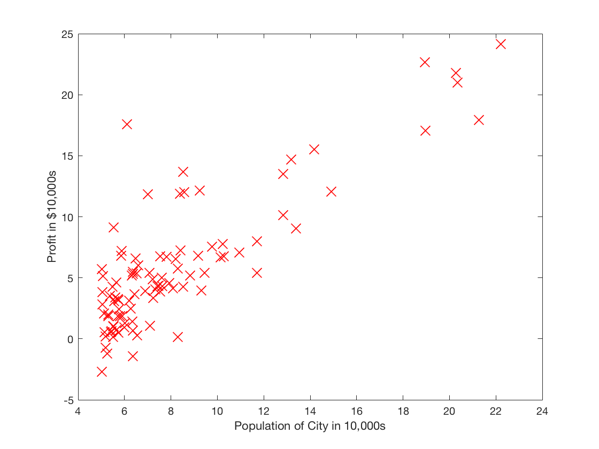
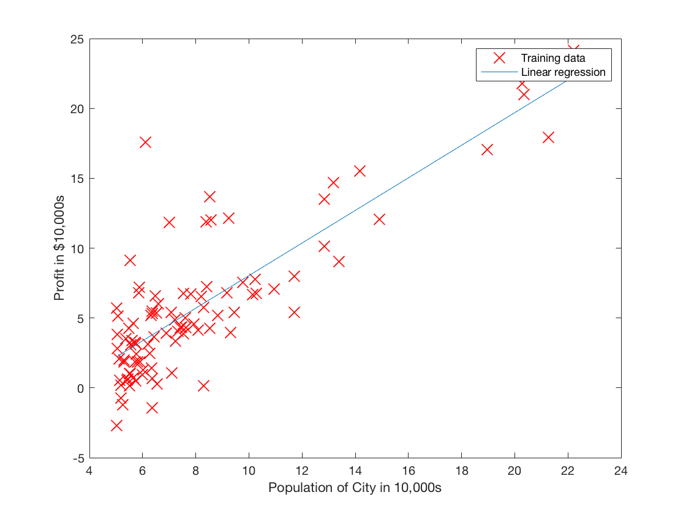
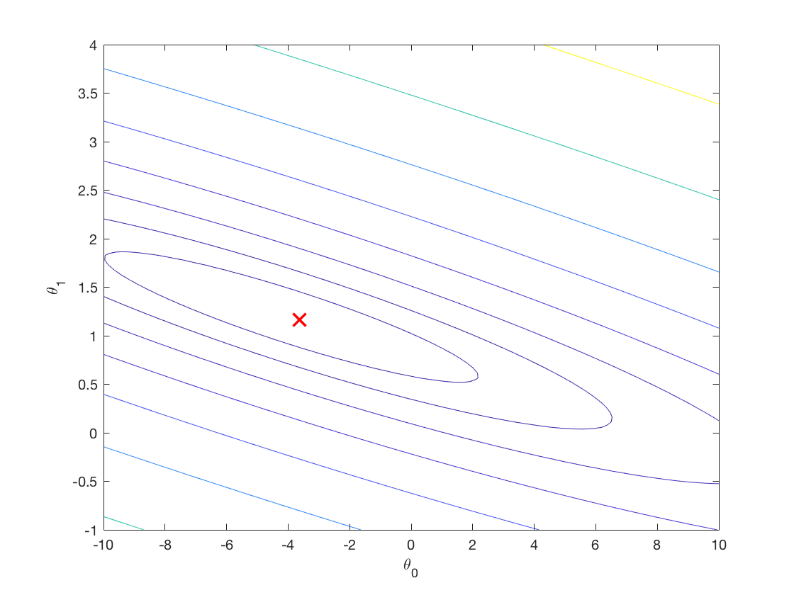
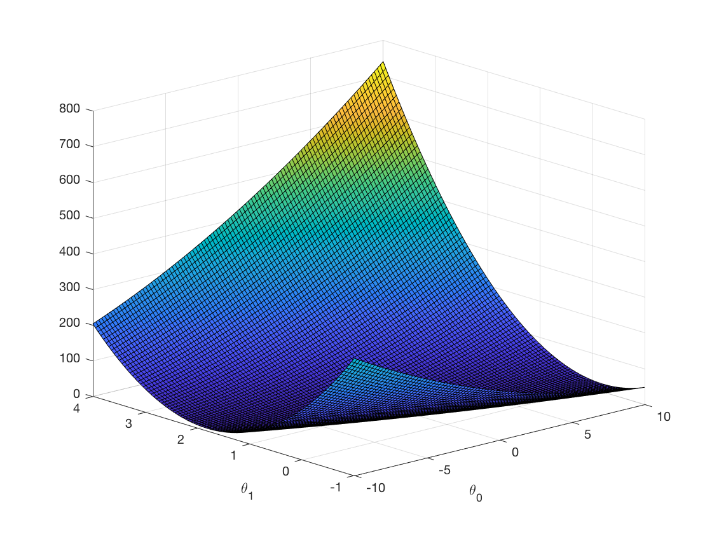
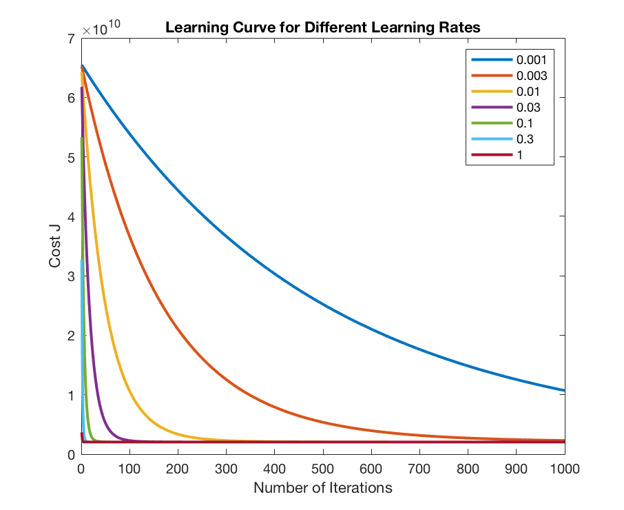

# Linear Regression (One Variable and Multivariate) #
---
### This folder contains all the codes relevant to the task of linear regression. The skeleton codes are provided by Professor Andrew Ng from the Coursera.org online course. The project description can be found from the [ex1.pdf](https://github.com/ys766/Coursera-Machine-Learning/blob/master/Assignment1/ex1.pdf) 
---
#### Part I: Linear Regression with One Variable
In this part, dataset contains the population of a city and the profit of a food truck in that city. The provided data is shown below in the figure below.

After using the gradient descent to minimize the squared error cost function, in this figure, the red line represents the learned regression line. 

This course also provides visualization for the cost function together with its contour plot 

 

#### Part II: Multivariate Linear Regression
In this part, linear regression is performed to predict the housing prices in Portland, Oregan. The features include the size (in square feet), and the number of bedrooms in the house. In this section, apart from using gradient descent, I explored the convergence rate or the learning curve for different values of learning rate. In the figure below, the horizontal axis is the number of iterations, while the vertical axis is the cost. Here I plotted the learning curve for different learning rates from 0.001 to 1.

We can see from the plot that the higher learning rate encourages faster convergence (if converges at all). 

