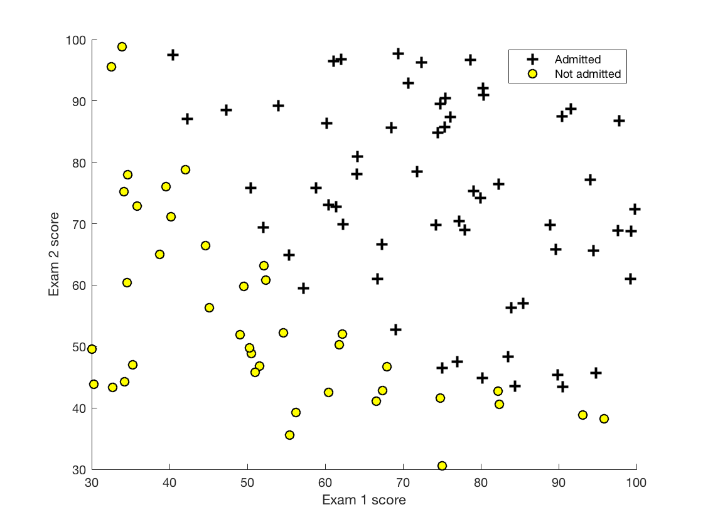
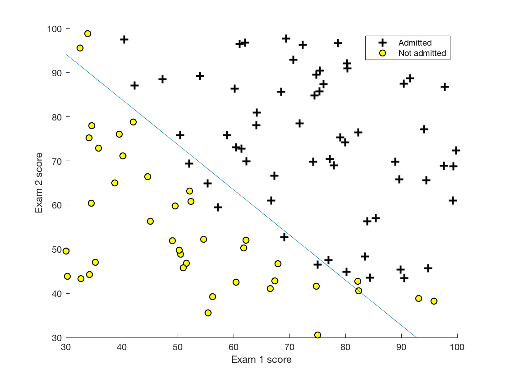
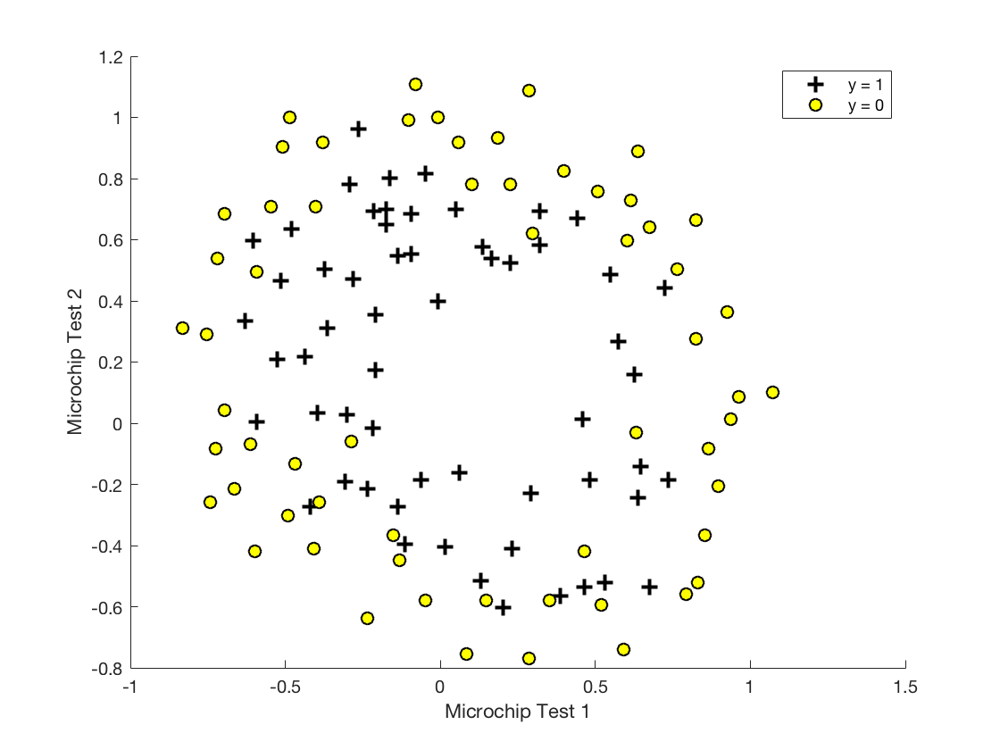
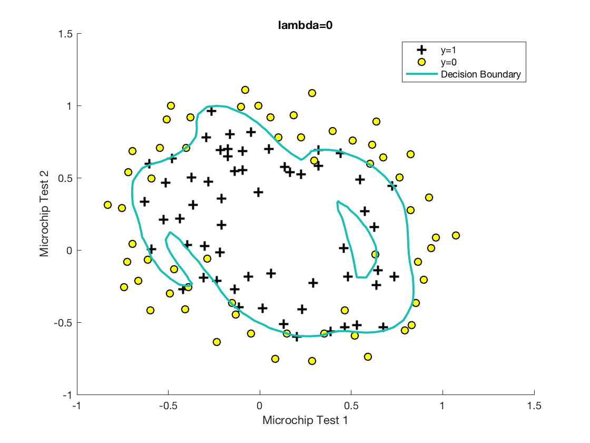
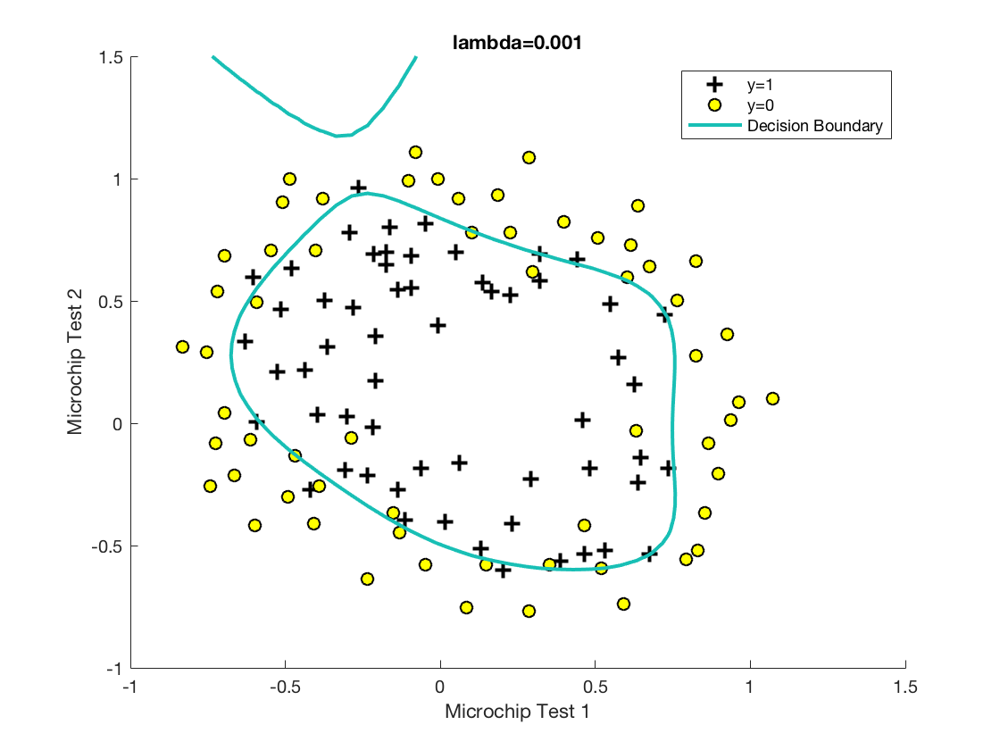
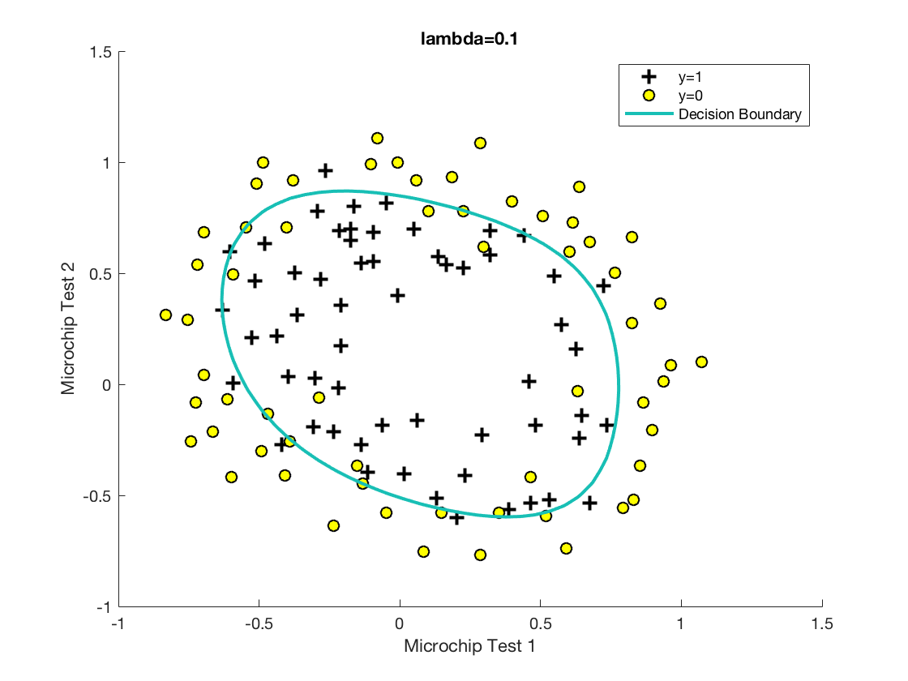
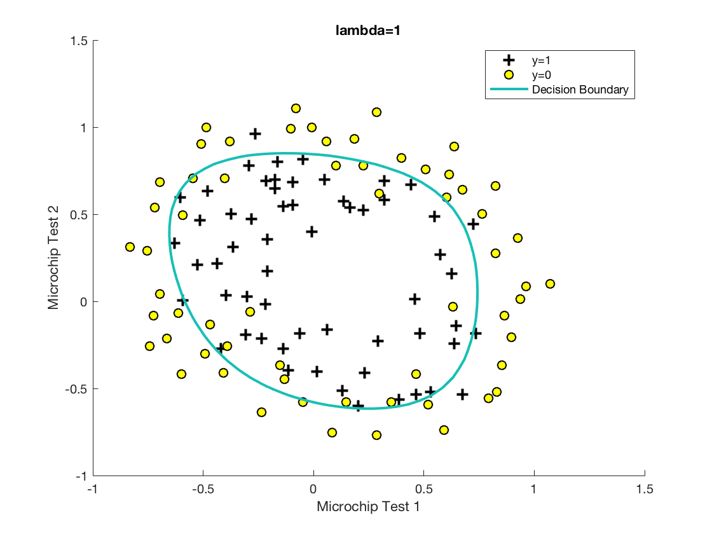
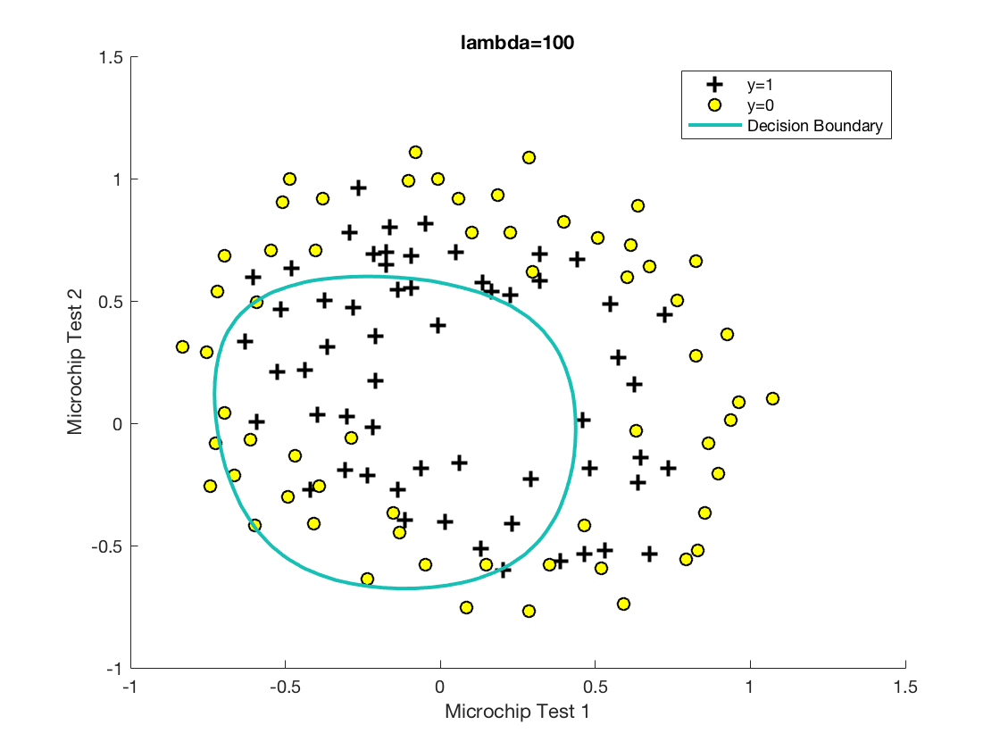

# Logistic Regression 
---
### This folder contains all the codes relevant to the task of logistic regression. The skeleton codes are provided by Professor Andrew Ng from the Coursera.org online course. The project description can be found from the [ex2.pdf](https://github.com/ys766/Coursera-Machine-Learning/blob/master/Assignment2/ex2.pdf) 
---
#### Part I: Unregularized Logistic Regression
In this part, dataset contains the scores of two exams to predict whether a student would be admitted or not. From the figure below, there exists an approximate linear separating line that divides the students into the two classes: those admitted and those not. 
Logistic regression (unregularized) tries to maximimize the likelihood of the data, or the probabilities that each data point is correctly assigned to a class.

After using the gradient descent to minimize the cost function for logistic regression, in this figure, the blue line represents the learned separating line.

Although some of the data points are mistakenly assigned to the wrong class, the likelihood of the whole dataset is maximized. 

---

#### Part II: Regularized Logistic Regression
In this part, logistic regression is applied to polynomial feature mapping in order to learn more complex separating hyper-surfaces. 
Basically, there does not exist a linear separating plane but when the features are mapped to a higher dimensional, there exists (approximately) a hyperplane that separates the data. The figure below shows the dataset used for this task. 

To obtain more complex decision boundaries, I mapped, according to the instruction, those two features into sixth order polynomial, and then the model parameters are learned using gradient descent. However, with large value regualarization constant, the bias is increased so that we cannot really learn the model. With a small lambda, the model tends to overfit the training set so that the model cannot generalize well to unseen dataset. The following figures demonstrate the results as the regualarization term is varied. 

Therefore, we need to choose the value of regularization to be the one that minimizes the cost in the validation set. In this case, a regularization constant equal to 1 is pretty good. 